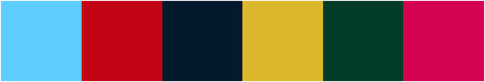

# auto-palette

> 🎨 A Rust library for automatically extracting prominent color palettes from images.

[](https://github.com/t28hub/auto-palette/actions/workflows/ci.yml)
[](https://crates.io/crates/auto-palette)
[](https://crates.io/crates/auto-palette)
[](https://app.codacy.com/gh/t28hub/auto-palette/dashboard?utm_source=gh&utm_medium=referral&utm_content=&utm_campaign=Badge_grade)
[](https://codecov.io/gh/t28hub/auto-palette)

## Features




> [!NOTE]
> Photo by <a href="https://unsplash.com/@laurahclugston?utm_content=creditCopyText&utm_medium=referral&utm_source=unsplash">Laura Clugston</a> on <a href="https://unsplash.com/photos/multi-colored-hot-air-balloon-pwW2iV9TZao?utm_content=creditCopyText&utm_medium=referral&utm_source=unsplash">Unsplash</a>

* Automatically extracts prominent color palettes from images.
* Provides detailed information on color, position, and population.
* Supports multiple extraction algorithms, including `DBSCAN`, `DBSCAN++`, and `KMeans++`.
* Supports multiple color spaces, including `RGB`, `HSL`, and `LAB`.
* Supports the selection of prominent colors based on multiple themes, including `Vivid`, `Muted`, `Light`, and `Dark`.

## Installation

Using `auto-palette` in your Rust project, add it to your `Cargo.toml`.

```toml
[dependencies]
auto-palette = "0.2.0"
```

## Usage

Here is a basic example that demonstrates how to extract the color palette and find the prominent colors.
See the [examples](./examples) directory for more examples.

```rust
use auto_palette::{ImageData, Palette};

fn main() {
  // Load the image data from the file
  let image_data = ImageData::load("../../gfx/holly-booth-hLZWGXy5akM-unsplash.jpg").unwrap();

  // Extract the color palette from the image data
  let palette: Palette<f32> = Palette::extract(&image_data).unwrap();
  println!("Extracted {} swatches", palette.len());

  // Find the 5 prominent colors in the palette and print their information
  let swatches = palette.find_swatches(5);
  for swatch in swatches {
    println!("Color: {}", swatch.color().to_hex_string());
    println!("Position: {:?}", swatch.position());
    println!("Population: {}", swatch.population());
  }
}
```

> [!TIP]
> `ImageData` struct used in the example above, is only available when the "image" feature is enabled in your `Cargo.toml`.
>
> ```toml
> [dependencies]
> auto-palette = { version = "0.2.0", features = ["image"] }
> ```

## Development

Follow the instructions below to build and test the project:

1. Fork and clone the repository.
2. Create a new branch for your feature or bug fix.
3. Make your changes and write tests.
4. Test your changes with `cargo test --lib`.
5. Format the code with `cargo +nightly fmt` and `taplo fmt`.
6. Create a pull request.

## License

This project is distributed under the MIT License. See the [LICENSE](/LICENSE) file for details.

[](https://app.fossa.com/projects/custom%2B14538%2Fgithub.com%2Ft28hub%2Fauto-palette?ref=badge_large&issueType=license)
